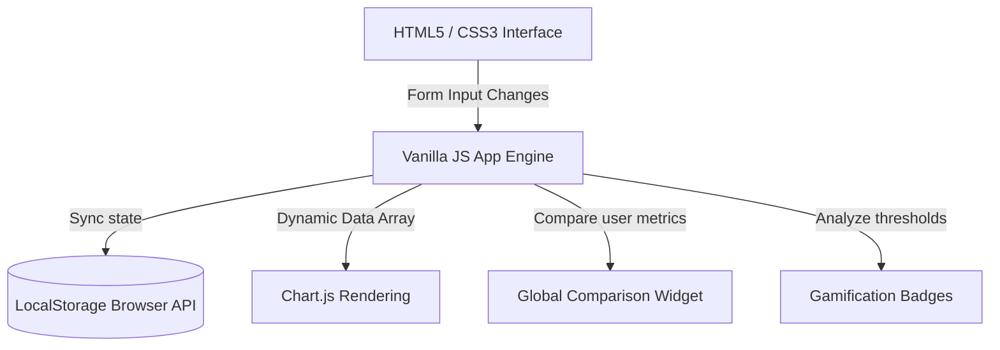

# EcoTrack - Carbon Footprint Awareness Platform

EcoTrack is a premium, hackathon-ready sustainability web application designed to help individuals track, calculate, analyze, simulate, and reduce their environmental impact. By translating abstract carbon calculations into relatable daily metrics and incorporating gamified challenges, EcoTrack bridges the gap between environmental awareness and personal climate action.

---

## 🌍 Why EcoTrack Matters
Individual footprints represent a substantial portion of global greenhouse gas emissions. However, citizens lack accessible tools to understand how their daily commuting, eating habits, utility consumption, and waste sorting translate into actual CO₂ volume. EcoTrack solves this by bringing carbon numbers to life through interactive visuals and personalized plans.

---

## 💡 Problem Statement
Climate change is the defining crisis of our time. While global climate goals are widely discussed, individuals often feel disconnected from the solution. Understanding one's own carbon footprint can be confusing due to complex calculation variables and abstract measurements (such as "Metric Tons of CO₂e"). Without visual translation and clear, actionable feedback loops, individual carbon reduction remains unguided and unmeasured.

---

## 🌱 Solution Overview
EcoTrack serves as a high-fidelity carbon reduction gateway by providing:
1. **Accurate Tracking**: Standardized, dynamic calculator based on localized carbon factor constants.
2. **Immediate Simulation**: A "What If" simulator that estimates carbon savings instantly before users commit to lifestyle changes.
3. **Actionable Recommendations**: Priority reduction tips and a personalized 7-Day Action Plan targeting the user's highest emission categories.
4. **Gamification**: Point scores, user progression ranks, and milestone badges that encourage consistent sustainable habits.

---

## 🚀 Key Features
- **Dynamic Carbon Calculator**: Calculates annual greenhouse emissions mapped across Transportation, Energy, Food Habits, and Waste.
- **Doughnut Charts Breakdown**: Seamless category visualizations rendered instantly via Chart.js.
- **What If Simulator**: Slider and toggle inputs allowing users to model reductions and see prospects instantly.
- **Global Average Comparison Widget**: Tracks user performance compared directly to the global per capita average of **4.80 Tons of CO₂**.
- **Personalized 7-Day Action Plan**: Dynamically updates based on the user's highest emissions category, rewarding points upon checkbox completions.
- **Points & Levels Gamification**: Progress from *Eco Beginner* to *Eco Guardian* based on points earned from calculations, checklists, and eco challenges.
- **Historical Line charts**: Track calculations and footprint average history dynamically over time.
- **Custom Reset Modals**: A custom glassmorphic reset data modal that purges browser local storage configurations and state variables cleanly.
- **High-contrast Accessibility**: Enhanced for screen readers and keyboard navigation via ARIA attributes and focus styles.

---

## 🛠 Technology Stack
- **Interface Structure**: Semantic HTML5
- **Visual Styles**: Vanilla CSS3 (Forest Green Theme, Glassmorphism, CSS Variables, dark/light theme triggers, smooth animations)
- **Application Logic**: ES6+ JavaScript (LocalStorage synchronization, event binding)
- **Data Visualizations**: Chart.js API via CDN
- **System Icons**: FontAwesome Web Kit API via CDN

---

## 📐 Carbon Calculation Methodology
All footprint metrics follow EPA and Carbon Trust standard carbon coefficients:

### 1. Transportation
$$\text{Annual Transportation } CO_2\text{ (kg)} = \text{Daily travel (km)} \times 365 \times \text{Vehicle factor}$$
- **Gasoline Car**: $0.171\text{ kg } CO_2/\text{km}$
- **Motorcycle**: $0.103\text{ kg } CO_2/\text{km}$
- **Public Bus**: $0.089\text{ kg } CO_2/\text{km}$
- **Train/Metro**: $0.035\text{ kg } CO_2/\text{km}$
- **Electric Vehicle**: $0.050\text{ kg } CO_2/\text{km}$

### 2. Home Energy
$$\text{Annual Grid Electricity } CO_2\text{ (kg)} = \text{Monthly usage (kWh)} \times 12 \times 0.475\text{ kg } CO_2/\text{kWh}$$

### 3. Food Habits
Flat annual diet-based footprint estimates:
- **Vegetarian/Vegan**: $1,500\text{ kg } CO_2/\text{year}$
- **Mixed Diet**: $2,500\text{ kg } CO_2/\text{year}$
- **Meat-Heavy Diet**: $3,300\text{ kg } CO_2/\text{year}$

### 4. Waste Generation
Flat annual production footprint estimates:
- **Low (Recycling & Composting focus)**: $200\text{ kg } CO_2/\text{year}$
- **Medium (Standard recycling)**: $400\text{ kg } CO_2/\text{year}$
- **High (No recycling, heavy packaging)**: $600\text{ kg } CO_2/\text{year}$

---

## 🏗 System Architecture



## ⚙️ Installation Guide
1. Clone the repository to your local computer:
   ```bash
   git clone https://github.com/your-username/Virtual-Challenge-3-Carbon-Footprint-Awareness-Platform.git
   ```
2. Navigate to the root directory:
   ```bash
   cd Virtual-Challenge-3-Carbon-Footprint-Awareness-Platform
   ```
3. Open `index.html` directly in your web browser.

---

## 📖 Usage Guide
- **Calculate**: Enter your daily travel km, select your vehicle class, list your monthly energy bills, and select your food and waste types. Click **Calculate Footprint** to update your statistics.
- **Simulate**: Toggle diet and recycling options in the simulator panel or slide distance reduction targets to see prospective carbon savings instantly.
- **Track**: Add specific target reduction percentages and date goals to monitor reduction progress.
- **Redeem**: Earn points and unlock custom ranks and badges by claiming finished eco challenges and completing daily action tasks.
- **Reset**: Click the trash can button in the header nav menu to clear all application data, wipe LocalStorage, and return all metrics to default states.

---

## ♿ Accessibility Features
- **Semantic HTML**: Built using `header`, `nav`, `section`, `form`, and `footer` landmarks.
- **ARIA Integration**: Configured `aria-label`, `aria-valuemin`, `aria-valuemax`, `aria-valuenow`, and `role="dialog"` attributes.
- **Focus Rings**: Added custom `:focus-visible` outline offsets to ensure seamless keyboard navigability.
- **High-contrast Colors**: Forest green palettes configured to exceed minimum contrast ratios for readable text lines.

---

## 🔮 Future Enhancements
- **Community Leaderboards**: Real-time ranks comparing carbon points with global peers.
- **Smart Meter API**: Real-time synchronization of home electricity bills.
- **Customized Local Grids**: Automatic grid emission index adjustments matching geo-coordinates.

---

## 📄 License
This project is licensed under the MIT License - see the LICENSE details for reference.
